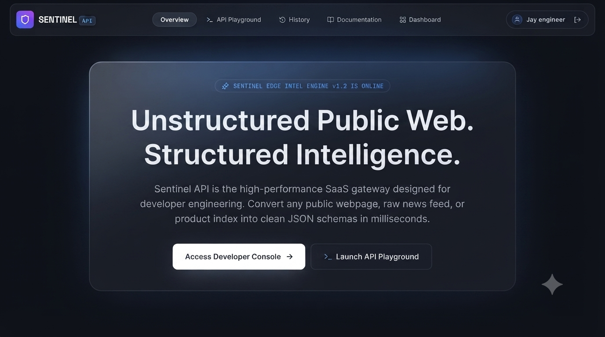
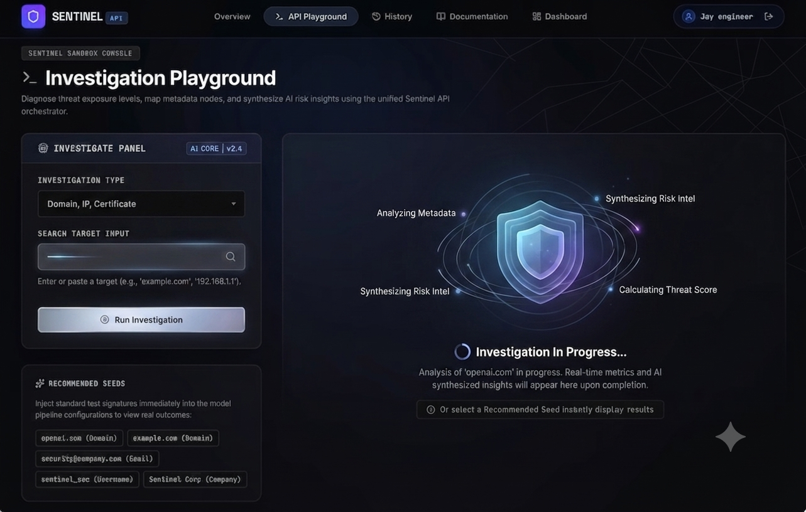
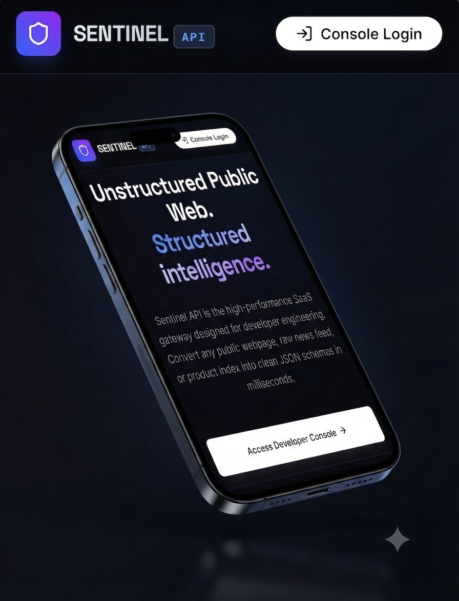

# Sentinel API

**Resilient Threat Intelligence Orchestrator with AI-Powered Meta-Analysis**

Sentinel is an API-first intelligence platform that fans a single query — a domain, email, company, username, or IP — out across parallel OSINT connectors (WHOIS, DNS, GitHub), normalizes and de-duplicates the resulting entities and relationships, and synthesizes the findings into a structured, evidence-linked report. A deterministic scoring engine assigns confidence and risk scores from explicit rules, and every AI-generated statement is passed through a hallucination detector before it reaches the client.

[](LICENSE)
[](package.json)
[](tsconfig.json)
[](VERSION.md)

---

## Table of Contents

- [Screenshots](#screenshots)
- [Features](#features)
- [Architecture](#architecture)
- [Tech Stack](#tech-stack)
- [Getting Started](#getting-started)
- [Environment Variables](#environment-variables)
- [Usage](#usage)
- [API Reference](#api-reference)
- [SDKs](#sdks)
- [Project Structure](#project-structure)
- [Testing](#testing)
- [Deployment](#deployment)
- [Documentation](#documentation)
- [Contributing](#contributing)
- [Security](#security)
- [License](#license)

---

## Screenshots

| Overview | API Playground |
|---|---|
|  |  |

<p align="center">
  
</p>

## Features

- **Parallel Multi-Source Investigation** — WHOIS, DNS, and GitHub connectors run concurrently per query, each with its own configurable timeout, retry policy, and circuit breaker.
- **Deterministic Confidence & Risk Scoring** — Confidence and risk scores are computed from an explicit, auditable rule set (`src/config/scoringRules.json`), not inferred by the AI model.
- **AI Meta-Analysis with Hallucination Detection** — Google Gemini synthesizes an executive summary and key findings from the collected evidence; every statement is cross-checked against verified entities/evidence and stripped or flagged if unsupported. The system degrades gracefully to a fully deterministic report generator if no AI key is configured or the model call fails.
- **Entity Resolution** — Overlapping entities returned by different connectors are merged and de-duplicated into a canonical graph.
- **Resilience by Design** — Exponential backoff retries, per-connector circuit breakers, and execution timeouts isolate upstream failures so one flaky connector can't take down an investigation.
- **Synchronous & Asynchronous Investigations** — Run a scan inline (`/investigate`) or queue it as a background job with progress polling (`/investigations`).
- **API Key Management** — Create, list, revoke, and rotate scoped API keys, each with its own per-minute rate limit.
- **Distributed-Ready Rate Limiting** — Sliding-window rate limiting keyed by API key or client IP, with an in-memory fallback store designed to swap in Redis without changing the call site.
- **Structured Observability** — JSON-structured logs, request ID correlation, and `/health` / `/ready` / `/version` probes for orchestration platforms.
- **Interactive API Docs** — A live Swagger UI served at `/docs`, generated from a hand-maintained OpenAPI 3.1 spec.

## Architecture

```
                       ┌──────────────────────────┐
   client / SDK  ───▶  │   Express API (server.ts)│
                       │  auth · rate limit · docs│
                       └────────────┬─────────────┘
                                    │
                       ┌────────────▼─────────────┐
                       │   InvestigationService    │
                       │  runs connectors in       │
                       │  parallel, merges results │
                       └────────────┬─────────────┘
                    ┌───────────────┼───────────────┐
              ┌─────▼─────┐  ┌──────▼──────┐  ┌──────▼──────┐
              │  WHOIS    │  │     DNS     │  │   GitHub    │
              │ Connector │  │  Connector  │  │  Intel      │
              └───────────┘  └─────────────┘  └─────────────┘
                                    │
                       ┌────────────▼─────────────┐
                       │   EntityResolutionService │
                       │  dedupe & canonicalize    │
                       └────────────┬─────────────┘
                                    │
                       ┌────────────▼─────────────┐
                       │    IntelligenceService    │
                       │  Gemini synthesis, or     │
                       │  deterministic fallback   │
                       └────────────┬─────────────┘
                                    │
                       ┌────────────▼─────────────┐
                       │   ValidationService       │
                       │  hallucination detection, │
                       │  evidence-grounding audit │
                       └────────────┬─────────────┘
                                    │
                       ┌────────────▼─────────────┐
                       │      ScoringService       │
                       │  deterministic confidence │
                       │  & risk rule engine       │
                       └────────────┬─────────────┘
                                    │
                            Structured Report
```

Background jobs are coordinated by `InvestigationWorker`, which runs the same pipeline asynchronously with incremental progress updates and cancellation support.

## Tech Stack

| Layer | Technology |
|---|---|
| Language | TypeScript |
| Backend | Express, Node.js |
| Frontend | React 19, Vite, Tailwind CSS |
| AI | Google Gemini (`@google/genai`) |
| Testing | Vitest, Supertest |
| Build | Vite (client), esbuild (server bundle) |

## Getting Started

### Prerequisites

- Node.js v18 or higher
- npm v9 or higher

### Installation

```bash
git clone https://github.com/JosephIwe/Sentinel.git
cd Sentinel
npm install
```

### Configuration

Copy the example environment file and fill in your values:

```bash
cp .env.example .env
```

At minimum, set `GEMINI_API_KEY` to enable AI-powered meta-analysis. See [Environment Variables](#environment-variables) for the full list — every AI feature has a deterministic fallback, so the app runs without a key too.

### Run the dev server

```bash
npm run dev
```

The app serves the Vite-powered frontend and the Express API together at `http://localhost:3000`.

## Environment Variables

| Variable | Required | Default | Description |
|---|---|---|---|
| `GEMINI_API_KEY` | No | — | Enables Gemini-powered report synthesis. Without it, the API falls back to a deterministic report generator. |
| `PORT` | No | `3000` | Port the Express server binds to. |
| `NODE_ENV` | No | `development` | Runtime mode. |
| `GITHUB_TOKEN` | No | — | GitHub PAT for higher-rate-limit GitHub intelligence scans. |
| `WHOIS_CACHE_TTL_MS` | No | `3600000` | WHOIS lookup cache TTL (1 hour). |
| `DNS_CACHE_TTL_MS` | No | `300000` | DNS resolution cache TTL (5 minutes). |
| `GITHUB_CACHE_TTL_MS` | No | `3600000` | GitHub connector cache TTL (1 hour). |
| `INVESTIGATION_CACHE_TTL_MS` | No | `300000` | Full-investigation result cache TTL (5 minutes). |

See [`.env.example`](.env.example) and [`DEPLOYMENT.md`](DEPLOYMENT.md) for the complete, annotated list.

## Usage

Every request under `/api/v1` (aliased at `/api`) requires either an `X-API-Key` header, an `Authorization: Bearer <key>` header, or an active browser session.

**Run a synchronous investigation:**

```bash
curl -X POST http://localhost:3000/api/v1/investigate \
  -H "Content-Type: application/json" \
  -H "X-API-Key: sn_live_your_key_here" \
  -d '{"type": "domain", "value": "openai.com"}'
```

**Queue an asynchronous investigation and poll for results:**

```bash
curl -X POST http://localhost:3000/api/v1/investigations \
  -H "Content-Type: application/json" \
  -H "X-API-Key: sn_live_your_key_here" \
  -d '{"type": "domain", "value": "openai.com"}'
# => { "jobId": "job_inv_...", "status": "queued" }

curl http://localhost:3000/api/v1/investigations/job_inv_... \
  -H "X-API-Key: sn_live_your_key_here"
```

## API Reference

An interactive Swagger UI is available at `/docs` (or `/api/v1/docs`) when the server is running, generated from the OpenAPI 3.1 spec at `/api/v1/openapi.json`.

| Category | Endpoints |
|---|---|
| Session Auth | `GET /auth/me`, `POST /auth/login`, `POST /auth/logout` |
| API Keys | `GET /keys`, `POST /keys`, `PUT /keys/:id/revoke`, `POST /keys/:id/rotate` |
| Investigations | `POST /investigate`, `POST /investigations`, `GET /investigations/:jobId` |
| Intelligence | `POST /intelligence/analyze` |
| History & Reports | `GET /history`, `GET /reports/:id` |
| Playground | `POST /playground/transform` |
| Operations | `GET /health`, `GET /ready`, `GET /version`, `GET /metrics` |

## SDKs

Official client libraries are available in [`sdks/`](sdks) for TypeScript and Python, covering both synchronous investigations and asynchronous job polling. See [`sdks/README.md`](sdks/README.md) for setup and usage examples.

## Project Structure

```
Sentinel/
├── server.ts                     # Express API gateway, routing, auth, rate limiting
├── src/
│   ├── api/                      # OpenAPI spec & Swagger UI renderer
│   ├── components/                # React frontend views
│   ├── config/                   # Scoring rule definitions
│   ├── connectors/                # WHOIS, DNS, GitHub (and reference-only) connectors
│   ├── services/
│   │   ├── investigation.ts       # Parallel connector orchestration
│   │   ├── investigationWorker.ts # Async job queue & lifecycle
│   │   ├── intelligence.ts        # Gemini synthesis + deterministic fallback
│   │   ├── validation.ts          # Hallucination detection & evidence grounding
│   │   ├── scoring.ts             # Deterministic confidence/risk rule engine
│   │   └── entityResolution.ts    # Entity dedup & canonicalization
│   ├── types.ts                   # Shared domain types
│   └── utils/                     # Frontend-facing validation, reliability, entity matching
├── utils/                         # Server-side observability, rate limiting, validation
├── sdks/                          # TypeScript & Python client libraries
└── tests/                         # Vitest unit & integration test suites
```

## Testing

```bash
npm run test
```

The suite covers the connector orchestration pipeline, deterministic scoring rules, hallucination detection, the async job worker, the rate limiter, and the HTTP API (auth, key management, rate limiting) via Supertest.

Type-check the project with:

```bash
npm run lint
```

## Deployment

```bash
npm run build   # Builds the client (Vite) and bundles the server (esbuild) into dist/
npm run start   # Runs the production bundle
```

See [`DEPLOYMENT.md`](DEPLOYMENT.md) for platform-specific guidance (Cloud Run, containers) and the full environment variable reference.

## Documentation

- [`DEPLOYMENT.md`](DEPLOYMENT.md) — deployment guide and environment configuration
- [`CONTRIBUTING.md`](CONTRIBUTING.md) — development setup and coding standards
- [`SECURITY.md`](SECURITY.md) — supported versions and vulnerability reporting
- [`CHANGELOG.md`](CHANGELOG.md) — release history
- [`VERSION.md`](VERSION.md) — current release phase and known limitations

## Contributing

Contributions are welcome. Please read [`CONTRIBUTING.md`](CONTRIBUTING.md) for development setup, coding standards, and the pull request process, and [`CODE_OF_CONDUCT.md`](CODE_OF_CONDUCT.md) before participating.

## Security

If you discover a security vulnerability, please **do not** open a public issue. Follow the private disclosure process described in [`SECURITY.md`](SECURITY.md).

## License

Distributed under the MIT License. See [`LICENSE`](LICENSE) for the full text.
